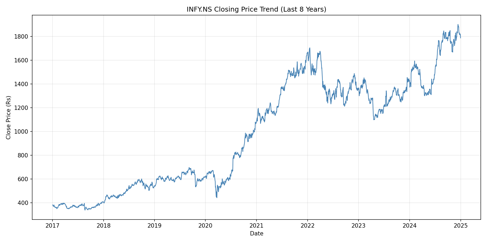
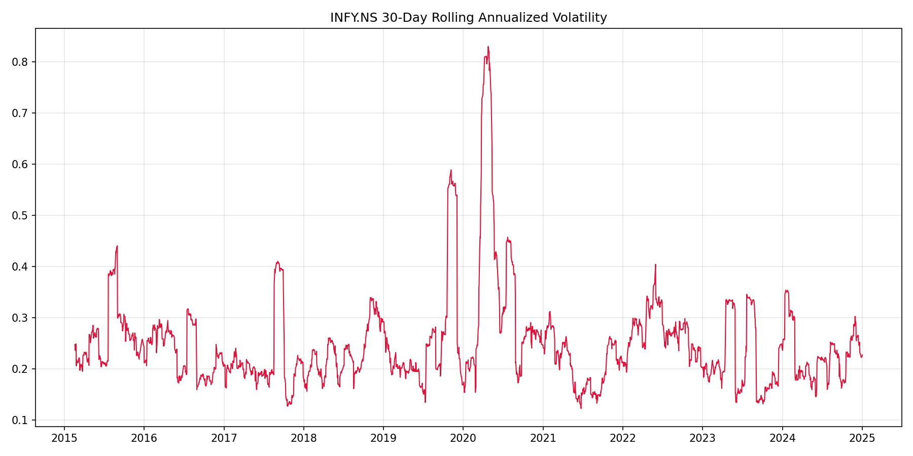
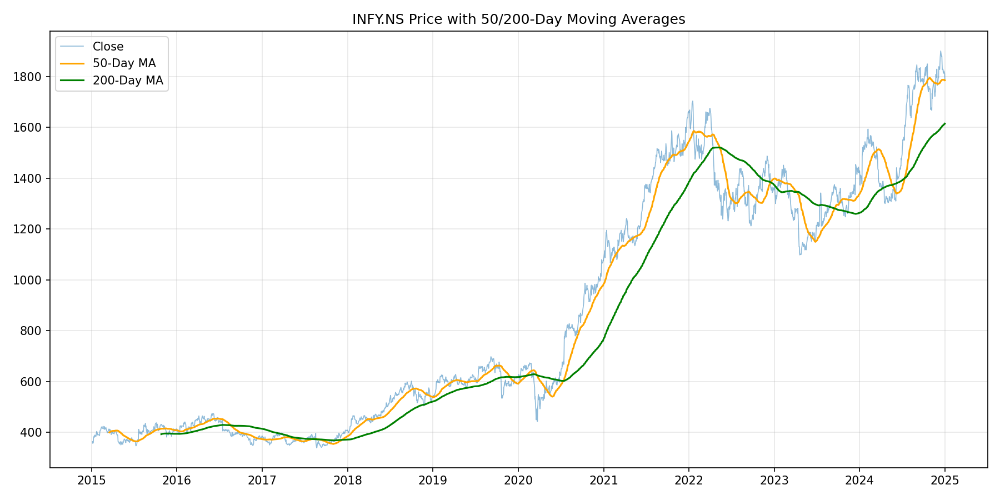
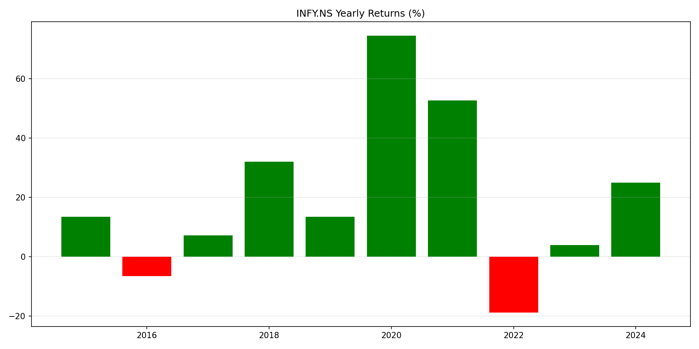
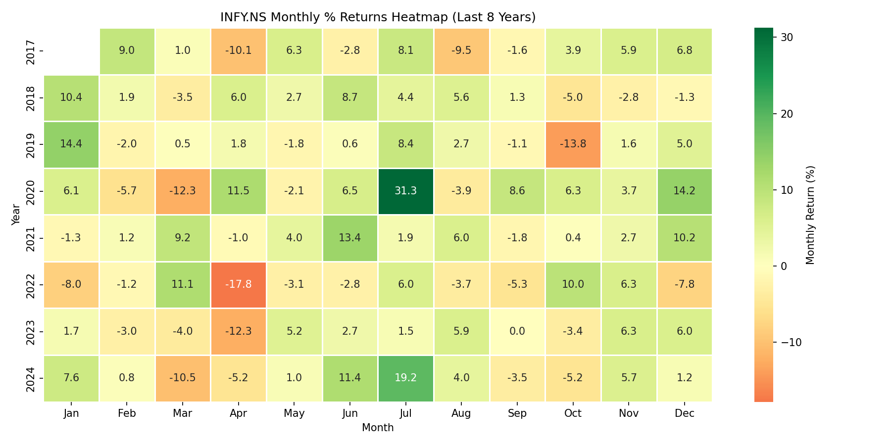
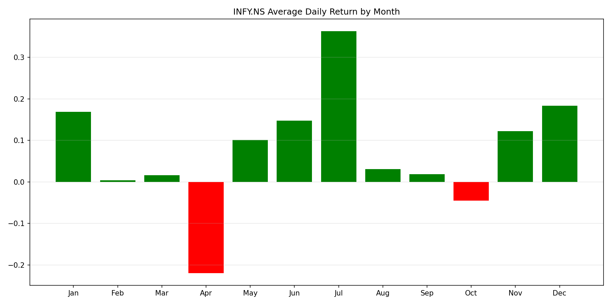
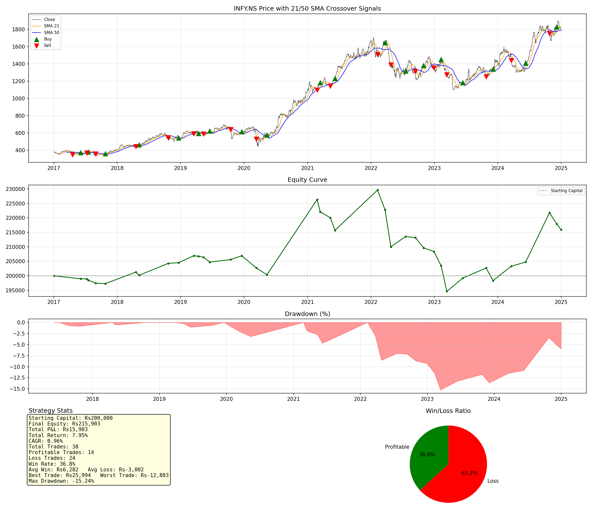

# Example Run: INFY on NSE (2015–2025)

A real output sample from `stock_analysis_skill.py`, generated with:

```bash
python3 scripts/stock_analysis_skill.py --symbol INFY --exchange NSE --start 2015 --end 2025
```

This demonstrates NSE support: the plain symbol `INFY` is auto-resolved to
`INFY.NS`, and all currency labels render in `Rs` automatically. All files
in this folder were produced directly by that single command.

## Dataset Overview

- **Symbol:** INFY.NS (NSE, currency `Rs`)
- **Date Range:** 2015-01-05 to 2024-12-31 (2,465 trading days)
- Full text summary: [`INFY_NS_analysis_report.txt`](INFY_NS_analysis_report.txt)

## Descriptive Analysis Charts

### Price Trend (last 8 years)


### 30-Day Rolling Annualized Volatility


### Price with 50/200-Day Moving Averages


### Yearly Returns (%)


### Monthly % Returns Heatmap (last 8 years)


### Seasonality — Avg Daily Return by Month


## 21/50 SMA Crossover Backtest

**Parameters:** starting capital `Rs 2,00,000`, lot size 50, last 8 years.

| Metric | Value |
|---|---|
| Total Trades | 38 |
| Profitable Trades | 14 |
| Loss Trades | 24 |
| Win Rate | 36.84% |
| Final Equity | Rs 2,15,903.44 |
| Total P&L | **+Rs 15,903.44 (+7.95%)** |
| CAGR | 0.96% |
| Avg Win | Rs 6,282.05 |
| Avg Loss | −Rs 3,001.88 |
| Best Trade | Rs 25,994.35 |
| Worst Trade | −Rs 12,802.55 |
| Max Drawdown | −15.24% |

Full stats file: [`INFY_NS_backtest_stats.txt`](INFY_NS_backtest_stats.txt)

### Strategy Dashboard


## Generated Data Files

| File | Description |
|---|---|
| [`INFY_NS_2015_2025.csv`](INFY_NS_2015_2025.csv) | Raw downloaded OHLCV data |
| [`INFY_NS_sma_signals.csv`](INFY_NS_sma_signals.csv) | Full daily data with SMA21/SMA50 + Buy(+1)/Sell(-1)/No-signal(0) |
| [`INFY_NS_backtest_trades.csv`](INFY_NS_backtest_trades.csv) | Full trade-by-trade log (entry/exit, direction, P&L, equity curve) |
| [`INFY_NS_backtest_stats.txt`](INFY_NS_backtest_stats.txt) | Summary backtest statistics |
| [`INFY_NS_analysis_report.txt`](INFY_NS_analysis_report.txt) | Dataset overview + descriptive stats report |

**Verdict:** Profitable over this window — unlike the [MSFT example](../msft/README.md),
this run had a positive edge (avg win Rs 6,282 vs avg loss −Rs 3,002),
despite a similar ~37% win rate, because the strategy caught INFY's larger
up-legs. See the main [README](../../README.md) for strategy pros/cons and
improvement ideas.
