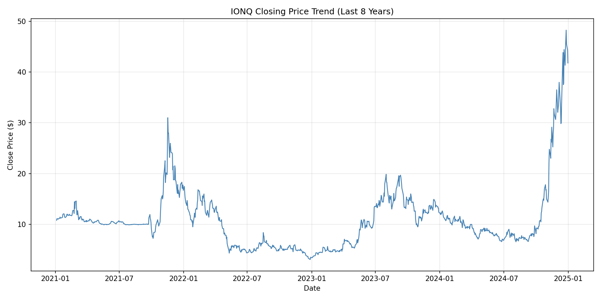
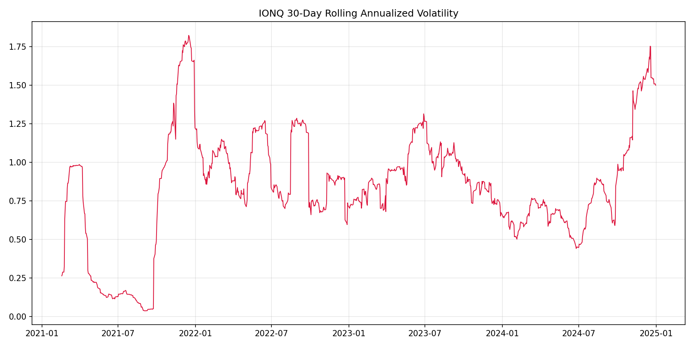
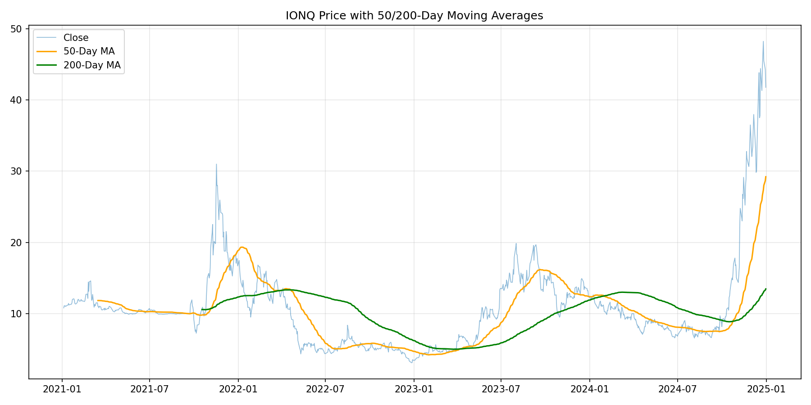
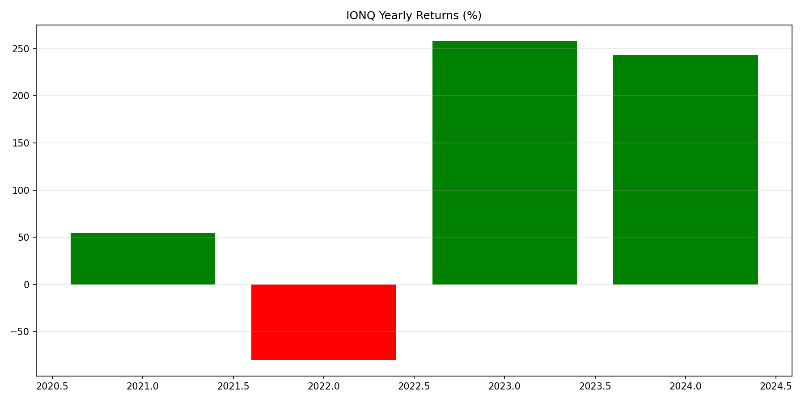
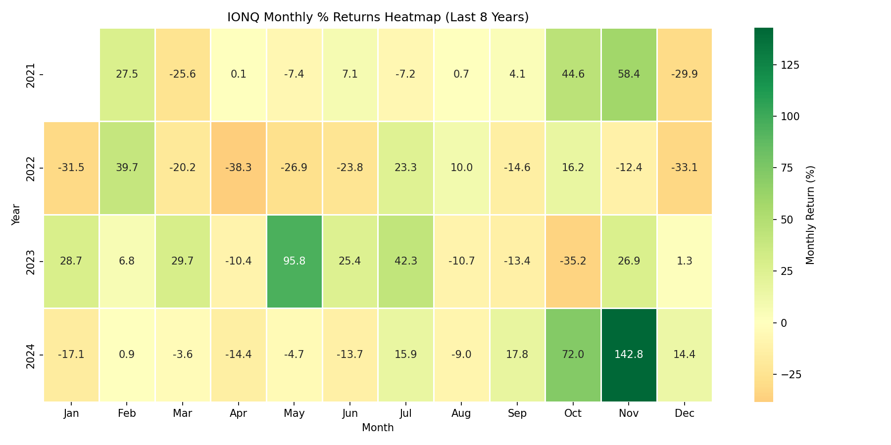
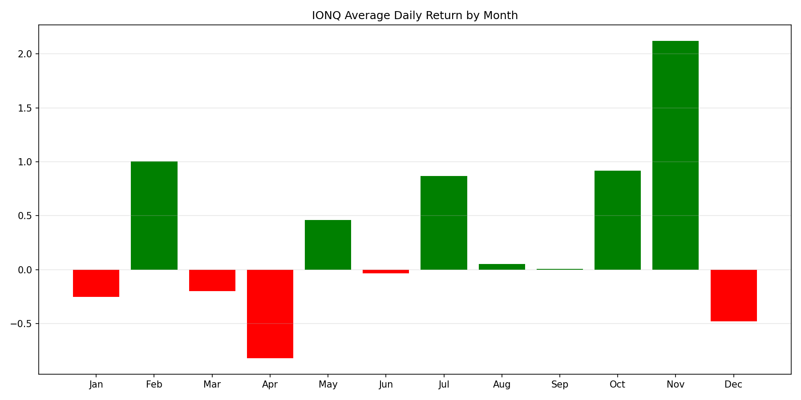
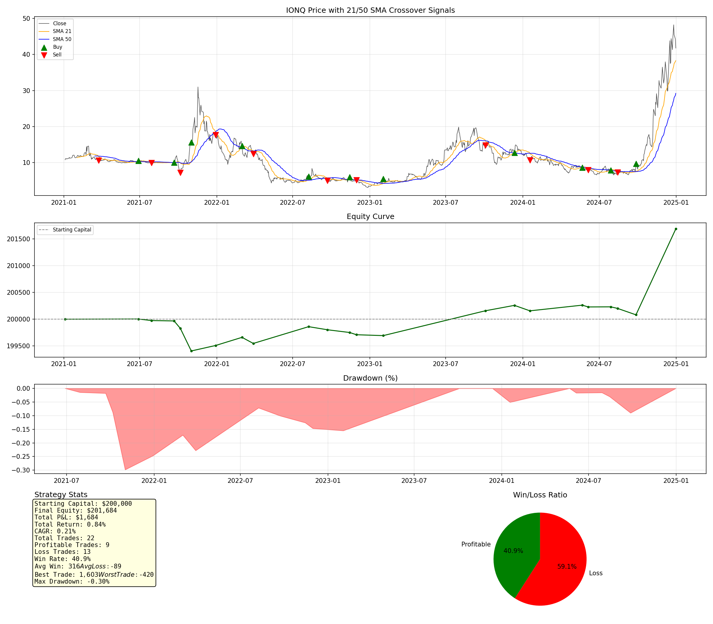

# Example Run: IONQ (2015–2025)

This is a real output sample from `stock_analysis_skill.py`, generated with:

```bash
python3 scripts/stock_analysis_skill.py --symbol IONQ --start 2015 --end 2025
```

All files in this folder (CSVs, charts, reports) were produced directly by
that single command — nothing here is hand-edited. IonQ only went public
(via SPAC merger) in late 2021, so `yfinance` only has data starting
2021-01-04 even though the requested range began in 2015 — the script
gracefully uses whatever history is available.

## Dataset Overview

- **Symbol:** IONQ (NYSE, currency `$`)
- **Date Range:** 2021-01-04 to 2024-12-31 (1,005 trading days)
- Full text summary: [`IONQ_analysis_report.txt`](IONQ_analysis_report.txt)

Highly volatile name: price ranged from $3.10 to $48.56, with annualized
volatility of ~92.7%. Yearly returns swung wildly: +54.6% (2021), −80.3%
(2022), +258.1% (2023), +243.5% (2024).

## Descriptive Analysis Charts

### Price Trend (last 8 years)


### 30-Day Rolling Annualized Volatility


### Price with 50/200-Day Moving Averages


### Yearly Returns (%)


### Monthly % Returns Heatmap (last 8 years)


### Seasonality — Avg Daily Return by Month


## 21/50 SMA Crossover Backtest

**Parameters:** starting capital `$200,000`, lot size 50, last 8 years
(effectively the full available history).

| Metric | Value |
|---|---|
| Total Trades | 22 |
| Profitable Trades | 9 |
| Loss Trades | 13 |
| Win Rate | 40.91% |
| Final Equity | $201,684.50 |
| Total P&L | **+$1,684.50 (+0.84%)** |
| CAGR | 0.21% |
| Avg Win | $316.22 |
| Avg Loss | −$89.35 |
| Best Trade | $1,603.00 |
| Worst Trade | −$420.50 |
| Max Drawdown | −0.30% |

Full stats file: [`IONQ_backtest_stats.txt`](IONQ_backtest_stats.txt)

### Strategy Dashboard


## Generated Data Files

| File | Description |
|---|---|
| [`IONQ_2015_2025.csv`](IONQ_2015_2025.csv) | Raw downloaded OHLCV data |
| [`IONQ_sma_signals.csv`](IONQ_sma_signals.csv) | Full daily data with SMA21/SMA50 + Buy(+1)/Sell(-1)/No-signal(0) |
| [`IONQ_backtest_trades.csv`](IONQ_backtest_trades.csv) | Full trade-by-trade log (entry/exit, direction, P&L, equity curve) |
| [`IONQ_backtest_stats.txt`](IONQ_backtest_stats.txt) | Summary backtest statistics |
| [`IONQ_analysis_report.txt`](IONQ_analysis_report.txt) | Dataset overview + descriptive stats report |

**Verdict:** Barely profitable (+0.84% total return) despite the stock's
massive swings — the slower 21/50 SMA crossover lagged behind IonQ's sharp
2023–2024 rally and only captured the tail end of it, keeping drawdown tiny
(−0.30%) but also capping upside. See the main [README](../../README.md)
for strategy pros/cons and improvement ideas.
