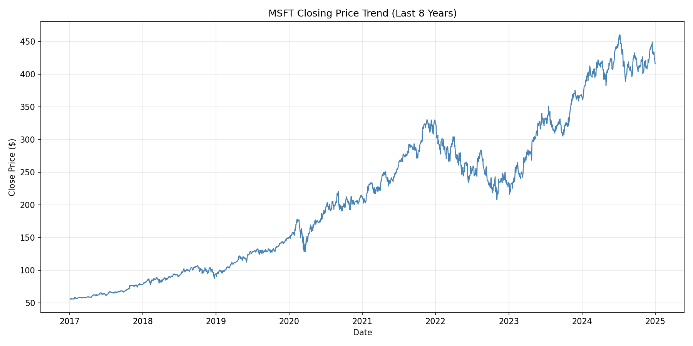
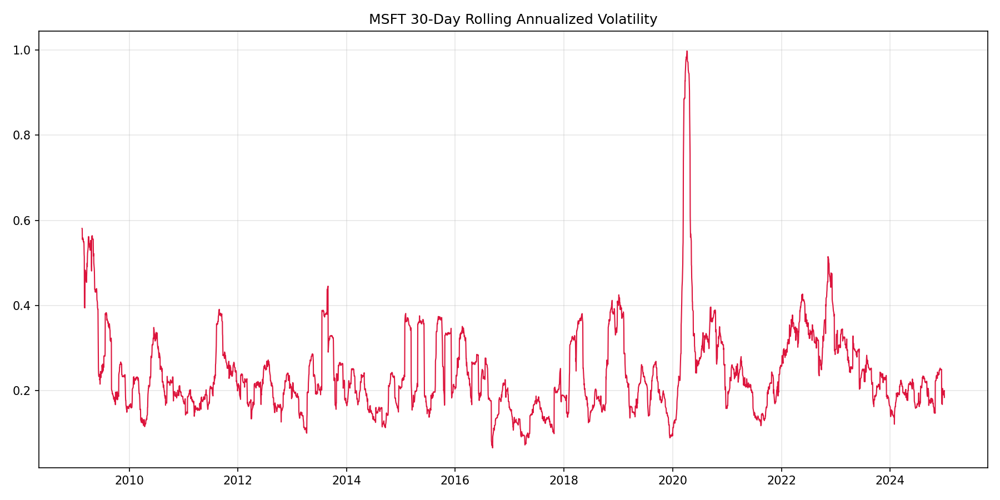
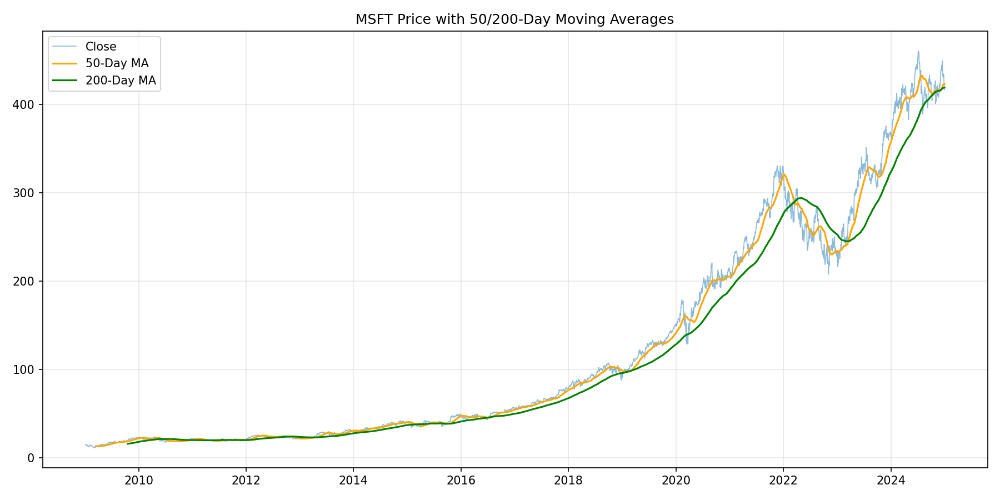
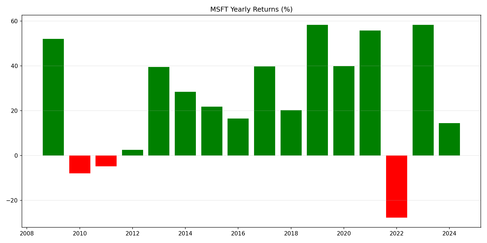
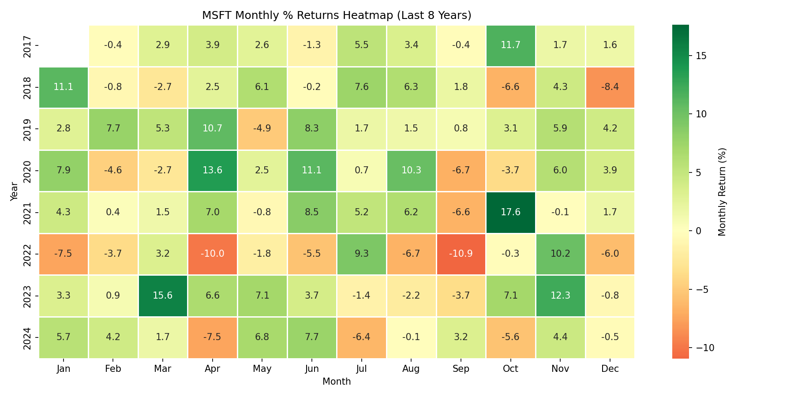
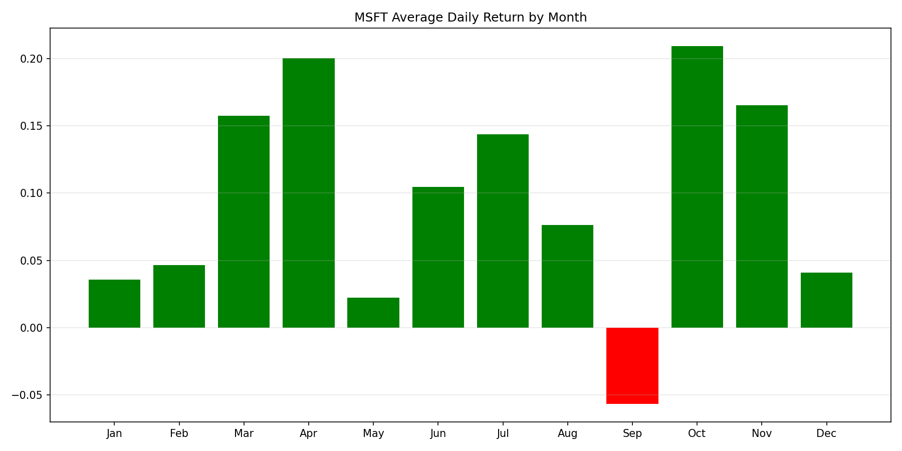
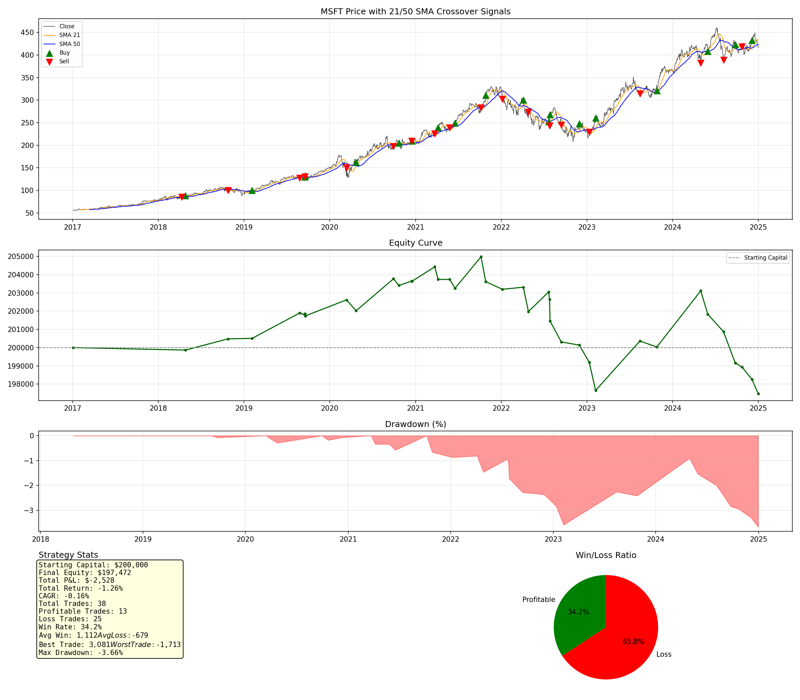

# Example Run: MSFT (2009–2025)

This is a real output sample from `stock_analysis_skill.py`, generated with:

```bash
python3 scripts/stock_analysis_skill.py --symbol MSFT --start 2009 --end 2025
```

All files in this folder (CSVs, charts, reports) were produced directly by
that single command — nothing here is hand-edited.

## Dataset Overview

- **Symbol:** MSFT (NYSE/NASDAQ, currency `$`)
- **Date Range:** 2009-01-05 to 2024-12-31 (4,025 trading days)
- Full text summary: [`MSFT_analysis_report.txt`](MSFT_analysis_report.txt)

## Descriptive Analysis Charts

### Price Trend (last 8 years)


### 30-Day Rolling Annualized Volatility


### Price with 50/200-Day Moving Averages


### Yearly Returns (%)


### Monthly % Returns Heatmap (last 8 years)


### Seasonality — Avg Daily Return by Month


## 21/50 SMA Crossover Backtest

**Parameters:** starting capital `$200,000`, lot size 50, last 8 years.

| Metric | Value |
|---|---|
| Total Trades | 38 |
| Profitable Trades | 13 |
| Loss Trades | 25 |
| Win Rate | 34.21% |
| Final Equity | $197,471.75 |
| Total P&L | **−$2,528.25 (−1.26%)** |
| CAGR | −0.16% |
| Avg Win | $1,111.76 |
| Avg Loss | −$679.24 |
| Best Trade | $3,081.34 |
| Worst Trade | −$1,712.76 |
| Max Drawdown | −3.66% |

Full stats file: [`MSFT_backtest_stats.txt`](MSFT_backtest_stats.txt)

### Strategy Dashboard


## Generated Data Files

| File | Description |
|---|---|
| [`MSFT_2009_2025.csv`](MSFT_2009_2025.csv) | Raw downloaded OHLCV data |
| [`MSFT_sma_signals.csv`](MSFT_sma_signals.csv) | Full daily data with SMA21/SMA50 + Buy(+1)/Sell(-1)/No-signal(0) |
| [`MSFT_backtest_trades.csv`](MSFT_backtest_trades.csv) | Full trade-by-trade log (entry/exit, direction, P&L, equity curve) |
| [`MSFT_backtest_stats.txt`](MSFT_backtest_stats.txt) | Summary backtest statistics |
| [`MSFT_analysis_report.txt`](MSFT_analysis_report.txt) | Dataset overview + descriptive stats report |

**Verdict:** Not profitable over this window — the strategy lost ~1.26%
despite a favorable avg-win/avg-loss ratio, because the win rate (34%) was
too low. See the main [README](../../README.md) for strategy pros/cons and
improvement ideas.
